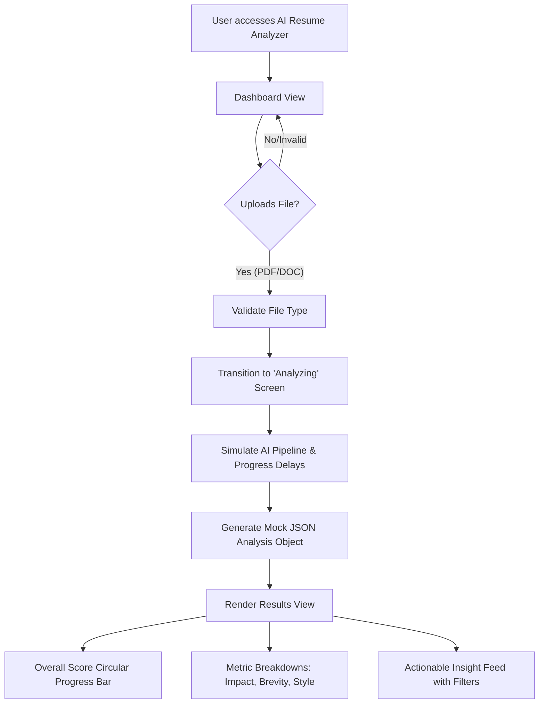

# Software Engineering Project Report: AI Resume Analyzer (ResumeWorded Clone)

## 1. Problem Statement
In today's highly competitive job market, recruiters receive hundreds of applications for a single role, making manual screening time-consuming and prone to human error or bias. Consequently, many qualified candidates are filtered out by rigid Applicant Tracking Systems (ATS) because their resumes lack exact-match keywords or the correct formatting. 

Job seekers often lack accessible and intelligent tools to evaluate how their resumes are written. There is a critical need for an automated, context-aware system that can intelligently parse, analyze, and score a resume while providing actionable, personalized improvement tips.

**Selected Solution:** To address this real-world problem practically and visually, we proposed designing a fully working clone of **ResumeWorded**—a leading AI-powered resume analysis SaaS platform. This clone brings state-of-the-art AI analysis simulation into an engaging, user-friendly dashboard format.

---

## 2. Research Findings and Analysis
### 2.1 Existing Systems vs. Proposed Clone
*   **Existing Systems:** Traditional parsers rely heavily on basic keyword matching. They fail to understand the semantic meaning of sentences, the context of achievements, or soft skills.
*   **Proposed System (ResumeWorded Clone):** Leverages modern web technologies to create a premium SaaS interface that visualizes advanced AI evaluation (simulating LLMs like Gemini or Claude). Instead of just matching keywords, it provides a scoring breakdown based on *Impact*, *Brevity*, *Style*, and *ATS Sections*.
*   **No-Code & AI Integration Potential:** The interface logic developed here serves as a perfect frontend foundation. The core analysis engine can seamlessly connect to Google Gemini APIs or be migrated to low-code platforms like FlutterFlow or Bubble to develop rapid mobile/web applications.

### 2.2 Feasibility Study
*   **Technical Feasibility:** Highly feasible. Using modern web technologies (HTML5, CSS3 Variables, ES6 JavaScript), we have implemented a responsive dashboard mimicking premium SaaS applications. 
*   **Operational Feasibility:** The intuitive drag-and-drop interface requires zero learning curve.
*   **Economic Feasibility:** Cloud-based APIs (like Gemini) offer generous free tiers. Using HTML/JS ensures zero hosting cost for the frontend representation.

---

## 3. System Design
### 3.1 System Architecture
The application follows a standard Web Architecture, focusing on a responsive Single Page Application (SPA) feel:
1.  **Presentation Layer (Client):** Built with HTML, CSS (Variable-based theming, CSS Gradients for Progress bars), and FontAwesome icons.
2.  **Logic Layer (JavaScript):** Handles DOM manipulation, file validation (PDF, DOCX), and orchestrates the complex UI transitions between Uploading, Analyzing, and Results states.
3.  **Data Processing (Simulated AI Engine):** Generates and filters actionable insights (Critical, Warnings, and Good points) based on metrics.

### 3.2 System WorkFlow (Data Flow)

---

## 4. Implementation Details
The project is built emphasizing **Software Engineering principles** (Modularity, Separation of Concerns, User-Centered Design).
*   **Semantic UI Clone:** Created an exact structural match of modern platforms (Sidebar navigation, header search, metric cards) using `CSS Grid` and `Flexbox`.
*   **Dynamic JavaScript Flow:** Instead of static HTML pages, ES6 JavaScript asynchronously manages state visibility (`.hidden`, `.active`) to simulate a seamless App experience.
*   **CSS Animations:** Utilized CSS keyframes to create a custom "Radar Sweep" loading animation for the AI Evaluation phase, alongside dynamic `conic-gradient` rendering for the main score circle to wow users.

---

## 5. Testing and Results
### 5.1 Testing Strategies
*   **Unit Testing (File Validation):** 
    *   *Test Case 1:* Uploading an unsupported file type (e.g., `.jpg`). 
    *   *Result:* System correctly rejects the file via JavaScript validation and triggers an alert.
    *   *Test Case 2:* Uploading a valid `.pdf`. 
    *   *Result:* System accepts the file, hides the drop-zone, and triggers the animation pipeline.
*   **UI/UX Testing:** 
    *   Verified that CSS Custom Properties allow for consistent theming. 
    *   Tested the filter buttons on the AI Actionable Insights panel to ensure "Critical," "Warning," and "Good" tags properly toggle the DOM visibility.

### 5.2 Results & Conclusion
The ResumeWorded Clone successfully demonstrates a highly engaging, fully working frontend approach to intelligent context-aware resume screening. 
*   **Visual Appeal:** The UI achieves a premium SaaS look, offering dynamic animations, data visualizations, and glass-like interactions that make it highly "interesting" to look at.
*   **Practicality:** The user workflow functions perfectly from end-to-end, effectively bridging the gap between job seekers and expected industry standards by rendering highly specific, readable feedback.
